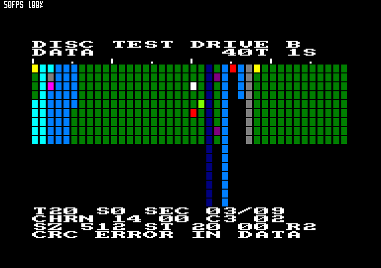
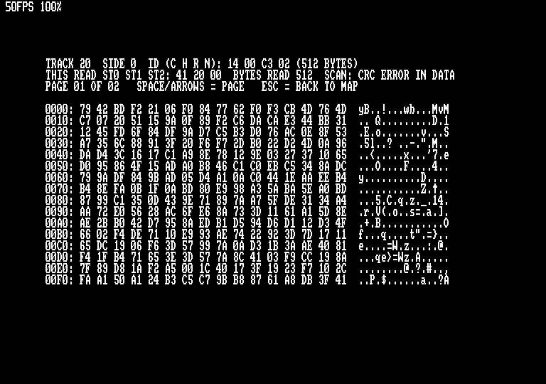
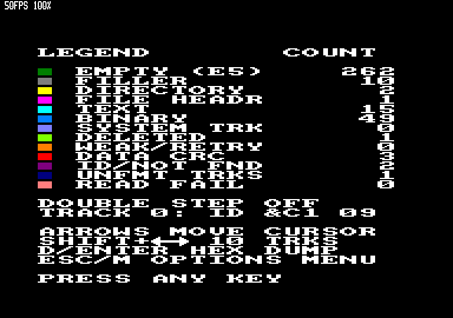

# DISCTEST – floppy disc tester for the Amstrad CPC

`disctest.asm` checks a floppy disc and draws a colour map of every track and
sector. The map shows which sectors are bad, which hold data, and what kind of
data each one holds. It programs the uPD765 floppy disc controller directly,
so it can read any format the CPC hardware can read, on 3" and 3.5" drives. It
**only reads**; it never writes to the disc.

Works on a CPC 664, a CPC 6128 or a CPC 464 with a DDI-1 disc interface, using
drive A or B.



## Building

```
./build.sh          # needs pasmo and python3
```

This produces `build/disctest.bin`, the raw code (load and run address &1000),
and `build/disctest.dsk`. The disc image holds `DISCTEST.BIN` with an AMSDOS
header, ready for an emulator or a floppy emulator (Gotek/HxC).

Other Maxam-style assemblers (WinAPE, RASM, …) should also work. The source
sticks to plain `org`/`equ`/`db`/`dw`/`ds` and `&` hex numbers.

## Running

* From the disc: `RUN"DISCTEST"`. When you quit, the CPC resets, because a
  program started with `RUN"` has no BASIC to return to.
* From BASIC, returning to BASIC when you quit:

  ```
  OPENOUT"D":MEMORY &FFF:CLOSEOUT
  LOAD"DISCTEST.BIN",&1000
  CALL &1000
  ```

  The `OPENOUT`/`CLOSEOUT` trick reserves AMSDOS's 4K file buffer first.
  Without it, `MEMORY &FFF` followed by `LOAD` gives *Memory full*.

After loading you can take out the program disc and insert the disc to test.

## Options menu

| Key | Option | Values |
|-----|--------|--------|
| 1 | Drive | A, B |
| 2 | Tracks | AUTO, 40, 42, 80 |
| 3 | Sides | AUTO, 1, 2 |
| 4 | Retries per bad sector | 0–5 (default 2) |
| ENTER / SPACE | start the scan | |
| ESC | quit | |

Press ESC during a scan to stop it. What has been scanned so far can still be
inspected.

## The map

* Columns are tracks and rows are sectors, sorted by sector ID. Tick marks
  above each map show every 5th track (tall ticks every 10th).
* Double-sided discs get two maps: side 0 on top, side 1 below.
* Up to 40 tracks, each cell is 2 bytes wide; above 40 tracks, 1 byte.
* The map starts with 10 rows. It grows to 16 as soon as a track with more
  than 10 sectors is found.
* The bottom lines show running totals while the scan runs: OK, BAD, WEAK and
  UNFMT (unformatted tracks).

### Colours

| Colour | Meaning |
|--------|---------|
| green | empty: every byte &E5 (formatted, never written) |
| grey | filler: every byte the same other value (e.g. all &00 or &1A) |
| bright yellow | CP/M / AMSDOS directory sector |
| bright magenta | AMSDOS file header (first record of a file, checksum valid) |
| bright cyan | text (at most 1/16 of the bytes outside printable ASCII/TAB/CR/LF/^Z) |
| sky blue | binary data (anything else that read correctly) |
| pastel blue | CP/M system tracks (tracks 0–1 of a SYSTEM format disc) |
| lime | deleted data address mark (read correctly) |
| orange | weak sector: failed at first, read correctly on a retry |
| bright red | CRC error in the data field |
| magenta | ID error: CRC error in the ID, sector not found, or no data address mark |
| dark blue | unformatted track (READ ID finds no sector header) |
| pink | read failure: drive not ready, overrun or timeout |
| black | no sector in that row |

## Map keys

| Key | Action |
|-----|--------|
| cursor keys | move the flashing cursor (down from the last row of side 0 moves onto side 1) |
| SHIFT + left/right | move 10 tracks |
| D, ENTER or COPY | hex + ASCII dump of the selected sector (the sector is read again) |
| L | legend with how many sectors of each kind were found, plus key help |
| ESC or M | back to the options menu |

The four lines under the map describe the sector under the cursor:

```
T20 S0 SEC 03/09        track, side, row / sectors on this track
CHRN 14 00 C3 02        sector ID as recorded on disc (hex)
SZ 512 ST 20 00 R2      size, FDC ST1 ST2 of the first attempt, retries used
CRC ERROR IN DATA       what it is
```

In the hex dump, SPACE or the cursor keys change pages of 256 bytes and ESC
returns to the map. The dump header shows ST0/ST1/ST2 and how many bytes
arrived on this read.

 

## Formats

The format is worked out from the disc itself (lowest sector ID and sector
count on track 0, side 0), so any layout can be scanned. These are recognised
by name:

| First ID | Name | Tracks × sides |
|----------|------|----------------|
| &C1 | DATA | 40 × 1 |
| &41 | SYSTEM | 40 × 1 (tracks 0–1 shown as system tracks) |
| &01, 8 sectors | IBM | 40 × 1 |
| &01, 9 sectors | D1 OR +3 (ROMDOS D1 or +3/PCW) | 80 × 2 if side 1 has IDs with H=1, else 40 × 1 |
| &21 | ROMDOS D2 | 80 × 2 |
| &11 | ROMDOS D10 | 80 × 2 |
| &91 | PARADOS 80 | 80 × 1 |
| &81 | PARADOS 41 | 41 × 1 |
| &A1 | PARADOS 40D | 40 × 2 |
| other | CUSTOM | 80 if double sided, else 40 |
| none | NO FORMAT | 40 × 1 |

Anything you set in the menu overrides the automatic choice.

**Double stepping:** the program seeks to physical track 2 and reads a sector
ID. If the ID says cylinder 1, the disc is a 40-track disc in an 80-track
(3.5") drive. It then steps two physical tracks per logical track.

**Sides:** the program reads IDs with head 1 selected. A real second side has
IDs with H=1. A single-head drive such as the 3" drive ignores head select and
returns the side 0 IDs (H=0) again, so that counts as one side.

## How it works

1. Motor on, wait 1 s, SPECIFY (step rate 12 ms, non-DMA), RECALIBRATE
   twice (80-track drives need more than 77 steps), then SENSE DRIVE STATUS
   (ready, write protect).
2. For each track and side: SEEK, then READ ID repeatedly. Each READ ID
   returns the next sector header passing under the head. Collecting IDs
   until the first two repeat gives every sector on the track in physical
   order, including odd IDs, duplicates and odd sizes.
3. Each sector is read with READ DATA, using its own C, H, R, N and EOT=R,
   with interrupts disabled. Bytes go into an 8K ring buffer at &8000–&9FFF;
   `res 5,h` wraps &A000 back to &8000, so even an N=6/7 sector can't overwrite
   anything.
4. Errors are retried (menu option). A sector that only reads on a retry is
   *weak*.
5. The data is classified: uniform → AMSDOS header checksum → directory
   entries → text ratio → binary.

The results for up to 80 tracks × 2 sides × 16 sectors are kept in memory.
The map, info lines and legend are drawn from this table.

Memory: program &1000 onwards, results table page-aligned after the code
(ends at about &7C40, checked in `build/disctest.sym`), sector buffer
&8000–&9FFF. Everything below HIMEM (&A67B) is left for AMSDOS.

## Limitations

* At most 16 sectors per track are stored and shown; the info line still
  shows the real count. Tracks with more sectors (e.g. 18 × 256 bytes) show
  the 16 lowest IDs.
* Sectors bigger than 8K (N=7) are classified from their last 8K.
* A weak sector is only detected when a read actually fails, so raise the
  retry count to hunt for marginal sectors.
* Tracks beyond 80 are not scanned.
* The FDC can't read FM (single density) discs this way; everything is read
  as MFM, like all CPC formats.

## Testing without a CPC

`tools/mkdsk.py tests DIR` builds test disc images:

| Image | Contents |
|-------|----------|
| `test_data_errors.dsk` | DATA format with files, data CRC errors, ID error, deleted data, unformatted track, 18-sector track, 8K sector, wrong-cylinder IDs, zero filler |
| `test_system.dsk` | SYSTEM format |
| `test_ibm.dsk` | IBM format |
| `test_d1_80t_2s.dsk` | 80 tracks, 2 sides, IDs &01–&09 |
| `test_parados80.dsk` | 80 tracks, 1 side, IDs &91–&9A |
| `test_blank.dsk` | unformatted |

`tools/emutest.sh` runs the program in the Caprice32 emulator without a
display and takes screenshots (see the comments in the script and
`docs/notes/cpc-fdc-notes.md`). All the images above were checked this way.
Caprice32 doesn't set ST2 DD on data CRC errors. DISCTEST copes with that:
a CRC error after data bytes have arrived is always a data CRC error.
